# Pets

A collection of shareable custom pets for Codex. Every pet uses the v2 animated
spritesheet format and includes a manifest ready to copy into your local Codex
pets directory.

## Included pets

|  |  |  |  |
| :---: | :---: | :---: | :---: |
| <a href="arrested-development/gob"><br><strong>Gob</strong></a><br><sub>Arrested Development</sub> | <a href="blade-runner/deckard">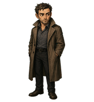<br><strong>Deckard</strong></a><br><sub>Blade Runner</sub> | <a href="blade-runner/rachael">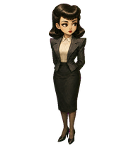<br><strong>Rachael</strong></a><br><sub>Blade Runner</sub> | <a href="firefly/mal">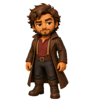<br><strong>Mal</strong></a><br><sub>Firefly</sub> |
| <a href="firefly/wash">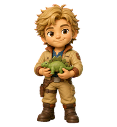<br><strong>Wash</strong></a><br><sub>Firefly</sub> | <a href="lord-of-the-rings/frodo">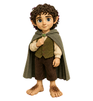<br><strong>Frodo</strong></a><br><sub>The Lord of the Rings</sub> | <a href="lord-of-the-rings/gollum">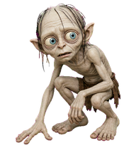<br><strong>Sméagol</strong></a><br><sub>The Lord of the Rings</sub> | <a href="lord-of-the-rings/samwise">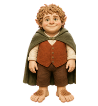<br><strong>Sam</strong></a><br><sub>The Lord of the Rings</sub> |
| <a href="lovecraft/cthulhu">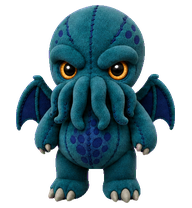<br><strong>Cthulittle</strong></a><br><sub>Lovecraft</sub> | <a href="originals/aion"><br><strong>Aion</strong></a><br><sub>Originals</sub> | <a href="originals/floppy">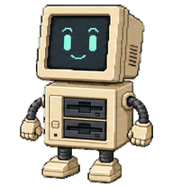<br><strong>Floppy</strong></a><br><sub>Originals</sub> | <a href="originals/oscillo">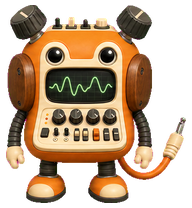<br><strong>Oscillo</strong></a><br><sub>Originals</sub> |
| <a href="seinfeld/elaine"><br><strong>Elaine</strong></a><br><sub>Seinfeld</sub> | <a href="seinfeld/george">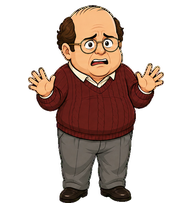<br><strong>George</strong></a><br><sub>Seinfeld</sub> | <a href="seinfeld/jerry"><br><strong>Jerry</strong></a><br><sub>Seinfeld</sub> | <a href="seinfeld/kramer">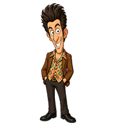<br><strong>Kramer</strong></a><br><sub>Seinfeld</sub> |
| <a href="seinfeld/newman"><br><strong>Newman</strong></a><br><sub>Seinfeld</sub> | <a href="star-trek/armus">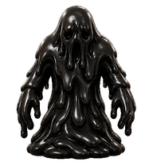<br><strong>Armus</strong></a><br><sub>Star Trek</sub> | <a href="star-trek/data">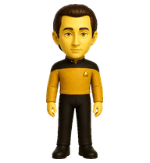<br><strong>Commander Data</strong></a><br><sub>Star Trek</sub> | <a href="star-trek/dr-crusher">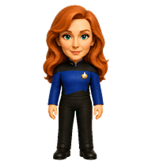<br><strong>Dr. Beverly Crusher</strong></a><br><sub>Star Trek</sub> |
| <a href="star-trek/laforge">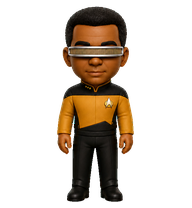<br><strong>Geordi La Forge</strong></a><br><sub>Star Trek</sub> | <a href="star-trek/o%27brien"><br><strong>Miles O'Brien</strong></a><br><sub>Star Trek</sub> | <a href="star-trek/picard">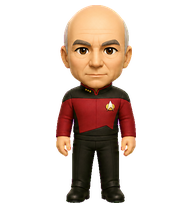<br><strong>Captain Picard</strong></a><br><sub>Star Trek</sub> | <a href="star-trek/q">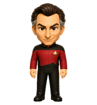<br><strong>Q</strong></a><br><sub>Star Trek</sub> |
| <a href="star-trek/riker">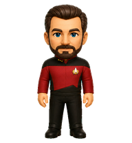<br><strong>Commander Riker</strong></a><br><sub>Star Trek</sub> | <a href="star-trek/troi">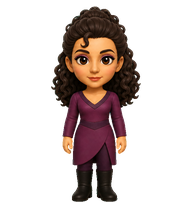<br><strong>Counselor Deanna Troi</strong></a><br><sub>Star Trek</sub> | <a href="star-trek/wesley">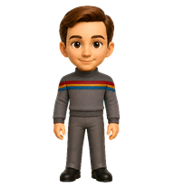<br><strong>Wesley Crusher</strong></a><br><sub>Star Trek</sub> | <a href="star-trek/worf">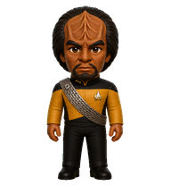<br><strong>Worf</strong></a><br><sub>Star Trek</sub> |
| <a href="stargate/jack"><br><strong>Jack O'Neill</strong></a><br><sub>Stargate SG-1</sub> | <a href="stargate/samantha">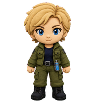<br><strong>Samantha Carter</strong></a><br><sub>Stargate SG-1</sub> | <a href="stargate/teal%27c"><br><strong>Teal'c</strong></a><br><sub>Stargate SG-1</sub> | <a href="tech/mona">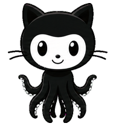<br><strong>Mona</strong></a><br><sub>Tech</sub> |
| <a href="the-matrix/morpheus">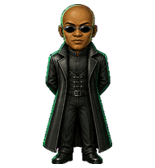<br><strong>Morpheus</strong></a><br><sub>The Matrix</sub> | <a href="the-matrix/neo">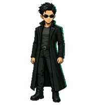<br><strong>Neo</strong></a><br><sub>The Matrix</sub> | <a href="the-matrix/trinity">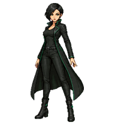<br><strong>Trinity</strong></a><br><sub>The Matrix</sub> |  |

## Installation

Each linked directory contains a `pet.json` manifest and `spritesheet.webp`. Copy
both files into a directory under `~/.codex/pets` whose name matches the `id` in
the manifest. For example:

```bash
mkdir -p ~/.codex/pets/data
cp star-trek/data/pet.json star-trek/data/spritesheet.webp ~/.codex/pets/data/
```

Restart or refresh Codex after copying the files.

## Attribution

These are unofficial fan-made mascot assets. They are not affiliated with,
endorsed by, or licensed by the creators, studios, publishers, or other rights
holders associated with the characters and properties that inspired them. All
character names, franchise names, and trademarks belong to their respective
owners.

See [LICENSE](LICENSE) for the sharing terms.
